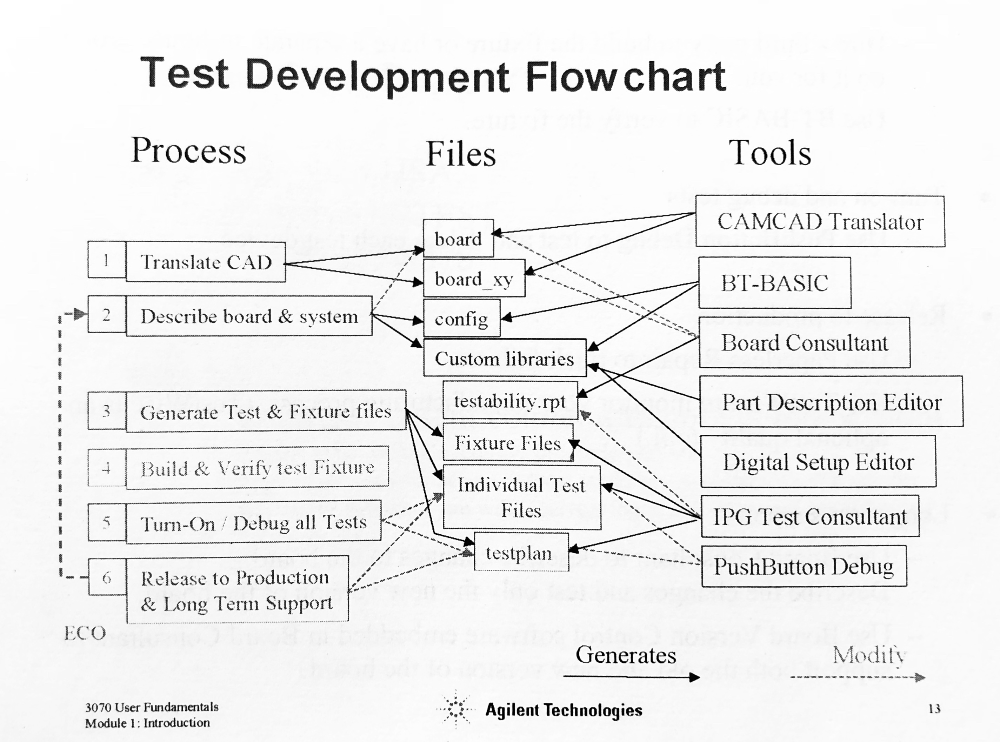
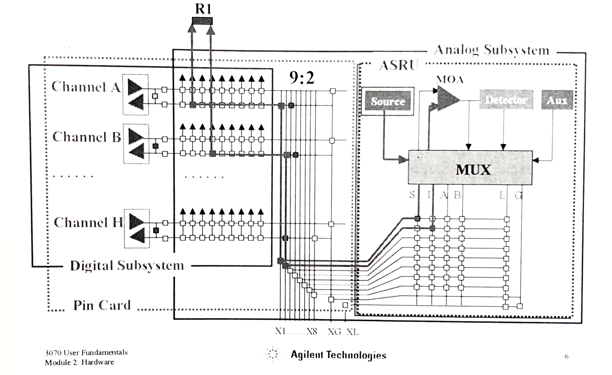

# General Notes

These notes will cover the important bits of information when doing in-circuit testing [ICT] using the Keysight / Agilent / HP 3070 ICT machines; they are all a continuation of the same machine, just the manufacturer has changed names over the years.

This file gives a general overview of ICT and the hardware of the 3070. They don't have much of structure but larger topics have been moved to seperate files.

## Overview

The 3070 machine generates a signal, which is transmitted to the printed circuit board [PCB] thorugh probes, then back to the machine. If the expected signal is read by the machine, then the test will pass.

The tests are software generated [including the stimulus and expected results] based of the PDB  desctription files.

## Test Types

Tests are autogenerated, and there are unpowered and powered tests.

### Unpowered Tests

- **Pins** [system-fixture-pcb continuity]
- **Preshorts** [tests switches, jumpers, potentiometers at expected settings]
  - This is done to ensure these devices do not fail in the Shorts Test
- **Shorts** [unexpected shorts]
- **Analog Incircuit** [tests for analog components]
  - resistors, capacitors, inductors, diodes, zener diodes, FETs, transistors
- **TestJet** [for proper soldering of IC and connectors]
- **DriveThru** [variation of TestJet, where signal goes through multiple devices]
  - for when you have limited access to PCB connections / parts
- **MagicTest** [like DriveThru for Analog Incircuit test]
- **Polarity Check** [lTestJet probe to test for polarity of capacitors]
- **ConnectCheck** [like TestJet, but alternate technique]

### Powered Tests

Powered tests, where if too much current is drawn, tests will fail assuming a short from power to ground.

- **Setup Power Supplies:** [test power draw]
- **Digital Incircuit:** [test individual digital ICs]
- **Analog Funcitonal:** [test individual analog IC] (aka: Powered Analog)
- **Mixed Signal:** [digital + analog]
- **Digital Functional:** [tests groups of devices]
- **Boundary Scan:** [JTAG]
  - Incircuit tests with probe
  - Interconnect tests with TDI / TDO

If an integrated circuit [IC] can be tested with TestJet, ConnectCheck, or custom library.

To debug tests, use PushButton Debug [PBD].

## Keysight / Agilent / HP 3070

This is divided into four quadrants, called modules; each module column is called a bank. Underneath each module is a vacuum pump, labelled a,b,c,d.

  bank   | 2 | 1 |
  ————————————————
  module | 2 | 0 |
         | 3 | 1 |

Each module has up to 11 cards:

- One ASRU card [slot 1]
- One Module Control card [slot 6]
- At least one Pin card [all other slots]

These cards are multiplexed [MUX], this allows for shared resources and thus more accurate measurements.

### Module Control Card

This card manages the actual measurement process within the given module. It has 8 general purpose [GP] relays: 100 Vpeak or 1 A, max 30 W.

During Analog Incircuit tests, all test resources are within one module by design.

- G and L buses [channels] are an exception, since they are used to isolate a device form the surrounding circuitry

In Digital Incircuit tests, the module control card handles all the handshaking between modules.

### Analog Stimulus Response Unit Card [ASRU]

When an analog incircuit test is executed, this card applies the appropriate stimulus and takesa voltage reading. For analog functional tests, there is a DC source, and a waveform generator.

- DC voltage readings are done by ASRU
- Frequency readings are done by control card

The heart of the ASRU is the Measuring Operational Amplifier [MOA].

The S bus is for the source, and the I bus is for the input; these are used by the MOA for the analog measurements.

### Pin Card + MUX

Hybrid Double Density Pin Cards can perform unpowered or powered tests; each one of these requires different resources.

## Pins / Probes

The 3070 machine uses pins to contact the board at different points. These are usually located below the board, but can be located above. There are two main types of pins: socket and socketless. The socket ones are more sturdy but are thicker since they have a cover all around the pint [socket]. The socketless probes taper at the bottom and fit into a smaller socket — so they're sort of a misnomer — this allows for a greater pin density.

These pins are installed onto the Pin cards, typicalled Hybrid Double Density [same number of columns, with half rows].

Each pin / probe is connected to one or more Personality Pins [PPin]. The PPin is where the machine reads or sends out signals / power. The connection between the PPin and probe can be wired or wireless; a wireless connection just means a PCB is used instead of physical wires.

There are geneally two versions of each probe: short and long versions. Use the appropriate one to make contact without damaging the board.

Probes are sharp in order to penetrate any contamination or oxidation on the surface of the connections.

## Board Consultant

This program is used to modify the `board` and `board_xy` files.

It also creates the `testability.rpt` file, which contains:

- tests used
- devices not completely tested
- other test coverage info

After evaluating this report is complete and accurate, run Test Consultant [this will regenerate and evaluate the `testability.rpt` file].

## Part Description Editor

Used to create custom library to describe a part; this must be placed in a `custom_lib` directory.

You can execute it using the `partforms` command.

## Test Consultant

These directories and files are generated by the **Test Consultant**:

| Directories   | Files       |
|---------------|-------------|
| `analog/`     | `testplan`  |
| `debug/`      | `testorder` |
| `digital/`    | `pins`      |
| `fixture/`    | `shorts`    |
| `ipg/`        | `safeguard` |
| `functional/` | `testjet`   |
| `mixed/`      |             |

### Directories

- `analog/` all test files for individual analog devices
  - one source and object file per test
  - included unpowered and powered analog tests
- `debug/` used by the PushButton Debug program
- `digital/` all test files for each decive or test
  - one source and object file per test
- `fixture/` all info about test fixture
- `ipg/` summary files describing test geneation process
- `functional/` tests for digital groups
- `mixed` digital and analog functional test tools

### Files

- `testplan` manages testing sequence
- `testorder` lists each test in order it is performed
- `pins` source and object files for pins test
- `shorts` source and object files for shorts test
- `safeguard` monitoring program that ensures devices adjacent to DUT are not damaged
- `testjet` source and object files of unpowered test of IC and connects

## Fixture

The goal of the fixture is to create an interface between the PCB and the computer, with the minimum impedance, reactance, or inconvenience.

The fixture ensures the pins make contact with the board at the correct locations; they are sharp in order to penetrate any contamination or oxidation on the surface of the connections.

### Personality Pins [PPin]

These are used to connect to the testhead resources. There are sometimes issues when PPins and probes are in the same location and thus would interfere with each other; this is more an issue with wired test fixtures.

### TestJet Probe

TestJet was also replaced by Vectorless Test Extended Performance [VTEP] whch is more accurate, up to 5 fF

This probe comprises of three parts:

- Sensor plate
- Electronics board
- TestJet pins

A small TestJet probe is used to test polarized capacitores.

## PushButton Debug

The interface used to verify the fixture, and to run and debug new tests.

To initialize and take control of Testhead:

- use the `Testhead is 1` macro
- `fixture lock`
- `get basic "testplan"`

To run a test:

- Macros > Testplan Macros > {test}

## Nodes

There are four different types of nodes that can be defined:

- **critical**
  - node is susceptible to noise
- **must be short**
  - node is not critical for testing
- **must be long**
  - node is critical for testing
- **fixed**
  - node is connected to power or ground via jumper
  - or, node that should not be driven during testing

### Fixed Nodes

Quick tip: fuses with the prefix `FB` are always used as filters from power so their pins will always be fixed nodes.

'Jumpers' include inductors, low-value resistors, fuses, and kelvin connects.

## Board Placement

Board placement can be run from a BT-Basic window with the command `board placement`. You most likely want the board placed in the centre of the test fixture with no rotation so you should use the command with these options: `board placement;center, rotation 0`.

You can only run this command once, so if you try running it again you will get errors. You can run board placement if you delete the `fixture/` folder.

## Fixture Consultant

You can use fixture consultant to view fixture resources and change the placement of the board.

In order to verify that test resources are not covered up by component pins you can view blocked pins by selecting from the menubar _Place Board_ and selecting _Estimate Blocked Pins_ in the pop-up window. This will show all the pins that may be blocked if the board is placed on this location of the board. There will be a lot of pins that appear to be blocked but can be safely ignored, including Pin Card Resource pins and Hyrbrid Ground pins. If in doubt which blocked pins may be safely ignored, ask.

Avoid blocked pins:

- TestJet
- rcvc
- gprelays

### Board Placement

You can move the board around the test fixture in order to reduce blocked resources. This is done by going to the _Place Board_ pop-up and dragging the board around.

### Placement information in `board_xy` file

Sometimes during the development process the fixture folder may be deleted, but in order to save time finding an acceptable placement that does not block too many resources, this placement is added to the `board_xy` file. These values are overridden by the fixture files but it means that the board placement does not need to start from scratch.

You can get the placement in the `fixture.o`file  [or `fixture` file, see **File Preparetion Notes**] by opening it in an external editor, as BT-Basic will not open the file since it thinks it is an object file [although this object file is actually a text file]. Copy the line that starts with `PLACEMENT` and add it to the `board_xy` file.

## Every File

Every file that is read using BT-Basic / IPG / Fixture consultant / etc needs to have an empty line at the end. Without this you will get unexpected errors and tests not compiled from testorder. Make sure you add / leave a **blank line** at the end of every text file.

## File: `board_z`

This file holds a pin library that models the impedance to ground from rails that have impedances lower than 1 kΩ. The first external pin of this library is connected to ground. It is modelled like a resistor pack, with one common node. This model needs to also be referenced in the `board` file.

## Moving Fixtures

- Faoff
- Disconnect air hoses + cables
  - these are located behind the fixture
- Align lift with fixture
