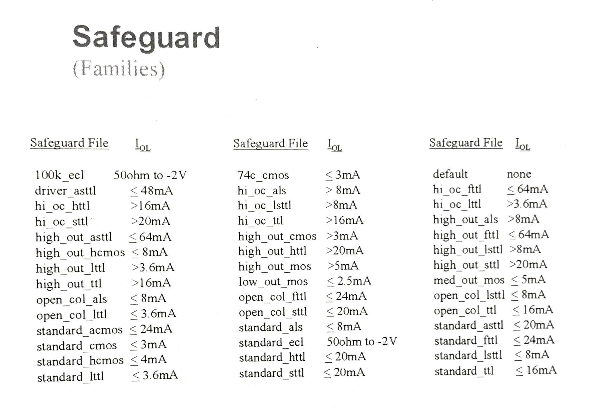

# Part Descriptions

Part Descriptions or Part Libraries, are files that define all the components in a device. For example, a BJT can be described as two diodes, or a resistor pack is just a bunch of resistors with pins for each side of the resistor. This allows for quicker defintion of multiple components. For example, using 10 resistor packs [each with 10 resistors] and defining each resistor would require 100 component definitions; instead, if we define a part library for the resistor pack we only have to define the 10 resistors, and then 10 resistor packs. When this is repeated for various components much time is saved, and allows for the part library to be reused with other boards in the future.

## Defining Custom Libraries

Sometimes, the a library for a device is not already written and we need to create a new one. These are the steps needed to create the custom library.

`// custom libraries go into the /custom_lib folder`

After the `board` and `board_xy` files are generated, and the perl script is run to populate the component values and information, you need to manually find the values that were not imported; it will be these components that need custom libraries.

The process is similar to modifying component values [in BT-Basic Notes] when a part; the script added a message that the component needs to be verified against the bill of materials [BOM]. For parts, the part number is populated with `"library_missing"`.

``` basic
<part_identifier> PN"<part_number>" "<vendor_part_number>"
U100 PN"library_missing" "12-0023-01";
```

`// the <vendor_part_number> is an internal part number, different manufacturers may have equivalent components but each  will have their own part numbers`

Once you have identified which components are missing, you can find the component in the schematic using the `<part_identifier>` [e.g. U100]. You can find the datasheet online with the manufacturer part number; this is found using the vendor_part_number and the BOM.

Rename the `PN` to the manufacturer part number [found in BOM], except for oscillators you may use a more descriptive name such as `osc_100mhz_4pin`, since this makes reusability of libraries easier.

## Making Changes

**Digital** and **analog** tests are run not from the source code but rather the compiled object files.

After modifying digital or analog libraries, very your changes didn't break anything by compiling them through BT-Basic:

`comp "<file_name>";lib`

- **part** libraries _do not_ need to be compiled
- **digital**, **analog**, and **mixed** libraries _need_ to be compiled.

Also make sure to add a warning that the current library is unverified by adding the line:

`warning "library is unverified"`

## Safeguard

In order to ensure devices are not damaged by unexpected shorts and the board drawing more current than is expected, a safeguard value may be enabled. This is done by checking the highest current with output logic low [I_OL], and using this value to decide which safeguard to use.



Electrical components are designed to function within _families_. These families all use the same voltage, so this allows for quick and easy circuit design since components can be reused and added like modules. _The family is also defined in the pin libraries, but that will be covered in a different section._

The picture above shows all the families that can be defined in the Custom Library for a component. You want to select the family with the lowest current that is greater than I_OL, but also relates to thge device; you wouldn't use the `hi_oc_httl` safeguard with a buffer.

### Example

- A cmos buffer with I_OL ranging form 0.7 mA to 9 mA, varying with supply voltage.
- Take the largest I_OL [9 mA] and compare it to the safegaurd options.
- 9 mA is ≥ `standard_cmos` [3 mA] and `standard_hcmos` [4 mA], but not `standard_acmos`
  - you want to select `standard_acmos` as the safeguard.

## Jumper

- Define each jumper component [inductor, connection, etc.].
  - give it a name [convention: `jpX`]
  - whether it is open or closed
  - optional: `nr` not individually replaceable
  - optional: `nt` not testable
  - error message
- Define each of the external nodes

### Example

Two inductors in parallel:

``` basic
!*****************************
' header here
!*****************************

jumper "jp1", closed, nr, "Pin 1 to Pin 2"
jumper "jp2", closed, nr, "Pin 3 to Pin 4"

external pins 1
  device "jp1" pins 1

external pins 2
  device "jp1" pins 2

external pins 3
  device "jp2" pins 1

external pins 4
  device "jp2" pins 2
```

## Resistor

- Define each resistor
  - give it a name [convention: `rX`]
  - value
  - +tolerance
  - \- tolerance
  - fixed / variable [`f` / `v`]

### Example

Two resistors in parallel:

``` basic
!*****************************
' header here
!*****************************

resistor "r1", 10k, 5, 5, nr
resistor "r2", 10k, 5, 5, nr

external pins 1
  device "r1" pins 1

external pins 2
  device "r1" pins 2

external pins 3
  device "r2" pins 1

external pins 4
  device "r2" pins 2
```

## Complex Package Device

This example contains several internal devices.


``` basic
'Part description library for package1

'import libraries
pin library "u1", nr, pn"7705"
pin library "rp1", nr, pn"rpack_type123"

'define individual components
resistor "r1", 10k, 5, 5, f, nr
capacitor "c1", 100p, 10, 10, f, nr

`define pin connections
external pins 1
  device "u1" pins 1

external pins 2
  device "u1" pins 2

external pins 3
  device "u1" pins 3

external pins 4
  device "u1" pins 4

external pins 5
  device "rp1" pins 1

external pins 6
  device "rp1" pins 2

external pins 7
  device "r1" pins 1

external pins 8; noconnect

external pins 9; noconnect

external pins 10
  device "c1" pins 2

external pins 11
  device "rp1" pins 3

external pins 12
  device "rp1" pins 4

external pins 13
  device "u1" pins 5

external pins 14
  device "u1" pins 6

external pins 15
  device "u1" pins 7

external pins 16
  device "u1" pins 8

'define internal node connections
node "internal_c1_r1"; nomanual
  device "c1" pins 1
  device "r1" pins 2
```

The `nomanual` keyword denotes a node that has no access [cannot be manually probed].

Components with non-accessible nodes will not have individual tests written by the test development software.

## Inheritance

Child devices inherit traits from their parents if `*` is entered as a designator for the child device. This will make the child device aliaed / associated with the parent.

The child will inherit:

- name
- replaceability
- testability
- safeguard
- device options
- _optional:_ failure message

This means you should never specify any of these parameters for an aliased device.

This is useful to:

- define internal analog characteristics of digital devices
  - improving accuracy of tests
- simplifies data entry into test development software

## Disable Pins [Digital Library]

If you cannot find the datasheet for a specific device and are unsure about which pins are `input` or `output`, mark them as `bidirectional` [both input and output].

It is important that all output pins are defined; if they are not, during test they may be overdriven and damage the device. By setting unknown pins to `bidirectional`, it ensures no pin is overdriven without warning, and that the resources to measure or drive the node are available. If an input pin is not defined as `input` [or output pin as `output`] then the resources for reading / driving will have to be manually added later [not ideal].

### Example

This is a digital library for a newly created library for a fanout buffer.

- define test characteristics [vector cylce, recieve delay, terminators]
- assign identifiers to pins
- define familly
- define inputs and outputs
  - if neither: `nondigital`
- set disable pins [condition for output disabled]

``` basic
!*****************************
' header here
!*****************************

warning "library unverified"

sequential

vector cycle 500n
receive delay 400n

set terminators to on

assign  VDD      to pins 4,10,13,16,19,22
assign  GND      to pins 25

assign  CTRL_A   to pins 5
assign  CTRL_B   to pins 6
assign  CLK      to pins 3,2

assign OUT0  to pins 24,23
assign OUT1  to pins 21,20
assign OUT2  to pins 18,17
assign OUT3  to pins 15,14
assign OUT4  to pins 12,11
assign OUT5  to pins 9,8

assign SLEEP to pins 7

assign VREF to pins 1

family LV_1_8V

power VDD,GND

inputs CTRL_A, CTRL_B, CLK, SLEEP

outputs OUT0, OUT1, OUT2, OUT3, OUT4, OUT5

nondigital VREF

disable OUT0 with SLEEP to "1"
disable OUT1 with SLEEP to "1"
disable OUT2 with SLEEP to "1"
disable OUT3 with SLEEP to "1"
disable OUT4 with SLEEP to "1"
disable OUT5 with SLEEP to "1"

`digital tests would go here
```