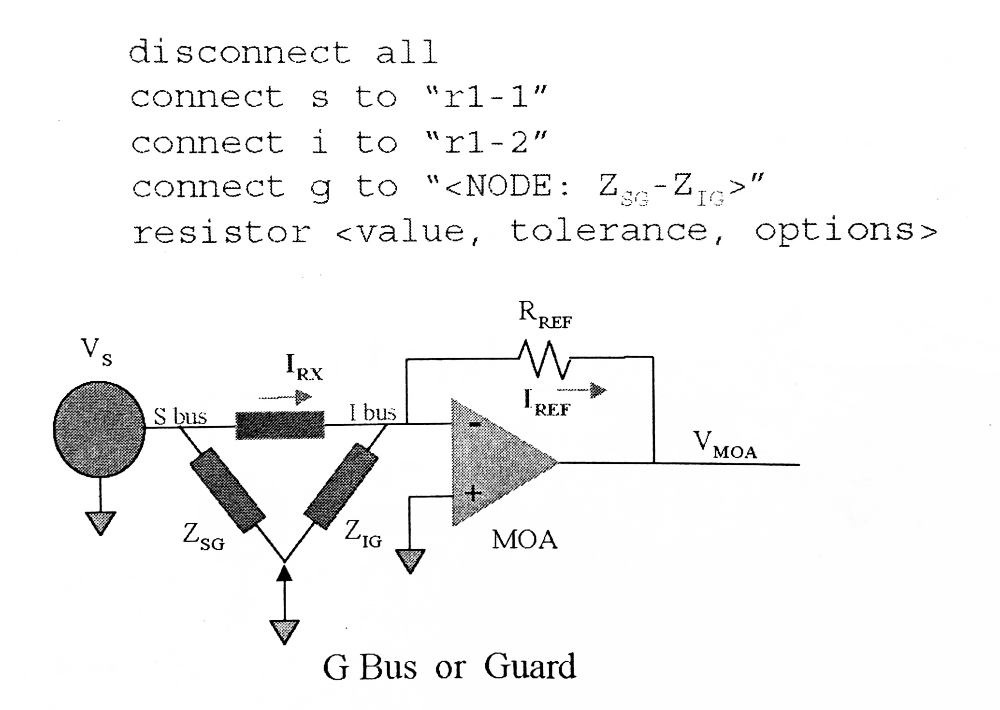

# Tests Notes

These notes cover in detail the tests performed with Keysight / Agilent / HP 3070 ICT machines.

Below is an except from `General Notes.md`

>## Unpowered Tests
>
>- **Pins** [system-fixture-pcb continuity]
>- **Preshorts** [tests switches, jumpers, potentiometers at expected settings]
>   - This is done to ensure these devices do not fail in the Shorts Test
>- **Shorts** [unexpected shorts]
>- **Analog Incircuit** [tests for analog components]
>   - resistors, capacitors, inductors, diodes, zener diodes, FETs, transistors
>- **TestJet** [for proper soldering of IC and connectors]
>- **DriveThru** [variation of TestJet, where signal goes through multiple devices]
>   - for when you have limited access to PCB connections / parts
>- **MagicTest** [like DriveThru for Analog Incircuit test]
>- **Polarity Check** [lTestJet probe to test for polarity of capacitors]
>- **ConnectCheck** [like TestJet, but alternate technique]
>
>## Powered Tests
>
>Powered tests, where if too much current is drawn, tests will fail assuming a short from power to ground.
>
>- **Setup Power Supplies:** [test power draw]
>- **Digital Incircuit:** [test individual digital ICs]
>- **Analog Funcitonal:** [test individual analog IC] (aka: Powered Analog)
>- **Mixed Signal:** [digital + analog]
>- **Digital Functional:** [tests groups of devices]
>- **Boundary Scan:** [JTAG]
>   - Incircuit tests with probe
>   - Interconnect tests with TDI / TDO

## Preshorts

Test run before Shorts test to ensure switches, jumpers, potentiometers are functioning, since they would cause Shorts test to fail; it also resets all variable components to expected values.

`// technically this is a subset of analog incircuit tests`

## Shorts

Uses 0.1 V source and 100 Ω resistor, which are not adjustable.

**Two sections:** expected and unexpected shorts.

- First, shorts are defined and are checked if they exist
- Second, these shorts are compared to all other nodes
  - to ensure there are no unexpected shorts

If an unexpected short is found, the hardware will isolate the nodes that are shorted together.

### Threshold

`threshold 16` defines that anything above 16 Ω is an open.

### Settling Delay

This defines how long to wait for reactive components to stabilize.

`settling delay 500m` defines a setting time of 500 ms

### Phantom Shorts

Shorts that were detected, but could not be isolated.

## Pins

This tests connects all pins to ground, except one. It checks for current flow at this pin, and assumes board connection if there is current flow.

**Different from shorts:** because it uses 2.5 V [instead of 0.1 V] to ensure diode / transistors will turn on; uses 10 kΩ [instead of 100 Ω].

If the software is trying to reverse bias a diode, it will use -2.5 V.

A node between two capacitors is isolated since no current can flow, and cannot be tested with pins test; thus the test should be commented out only when nodes are isolated.

## Analog Incircuit Test

These tests measure each individual analog device.

Each test has three component:

- relay control statements
- test commands

``` basic
'relay commands
disconnect all
connect <bus> to <node>

'test commands
resistor <value> <+tol> <-tol> <option_list>
```

**Options:**

- `wb` specified use of a WideBand frequency response
  - improves gain of MOA, which tends to improve repeatability
  - do not use when `re1` or `re2` are used, as tends to saturate MOA
- `reX` reference resistor to 10^`X` Ω [`X` = 1...5]
- `arX` ASRU's autorange to `X` V
- `comp` / `nocomp` compensation, included for some small value capacitors

_For reactive components:_

- `arX` ASRU's autorange to `X` V
- `icoX` current compliance: `0` for 35 mA `1` for 150 mA
- `frX` source frequency: [`X` = 128, 1024, 8192]
  - `fr128` required for `ed` [extra digit]
- `pm` / `sm` to account for parasitic resistances, parallel or series model
  - capacitors default is parallel
  - inductors default is series.

### Guarding

Since Device Under Test [DUT] is usually not isolated on the board, there will be parallel paths that will divert current around the DUT.

Guarding is used to account for this, and ensure proper measurements. It makes it so that the current through the DUT is the same as the current through the reference resistor of the MOA [measuring Op-Amp]



### Reality

Since nothing is ideal, there are impedances introduced by the buses, traces, and MOA.

## TestJet / VTEP

This test measures the capacitance of the lead between the log of the device and the die, also works with connectors. All devices to be tested are stored in the same test file.

- First it guards all the non-power leads, except one
- Applies stimulus signal.
- Measures reactive signal due to capacitance with MOA

**Limitations:** DUT must not have internal ground plane above the die.

## Digital Testing

The goal of digital testing is to test every individual digital device, by excercising every input and output; each pin should be driven high / low. If a device can have high impedance output mode [output disabled], this state should be tested.

### Preconditioning

This sets all outputs of upsteam devices to high output impedance state (Z) or a known state (1 or 0). Tis is done to ensure upstream devices are do not overheat by being _overdriven_; usually this is not the case and no preconditioning is required.

- bus disabling
- upstream conditioning
- upsteam disabling
